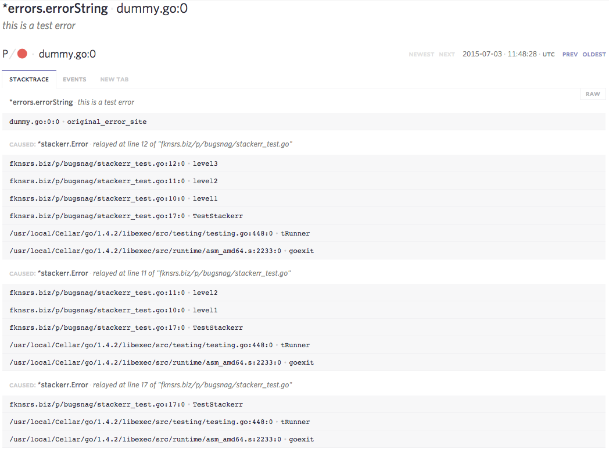

bugsnag
=======

Overview
--------

Package bugsnag provides a library for sending data to the bugsnag error
reporting service. It differs from the official library by having special
support for [stackerr](http://github.com/facebookgo/stackerr) and a more
complete data model.

See the [documentation on GoDoc](https://godoc.org/fknsrs.biz/p/bugsnag).

The main benefit of having special support for stackerr is that we can unwrap
its stack traces and send them up as individual exceptions to bugsnag. This
results in the following information being displayed in the bugsnag UI:

This shows us every point where `stackerr.Wrap(err)` was called, which can help
you trace the path of asynchronous errors through your program.

License
-------

3-clause BSD. A copy is included with the source.
